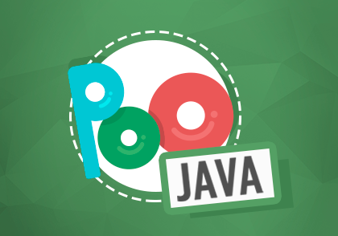

# Curso de POO usando o Java

 

.: *Contém os "códigos" das aulas.* 
.: *Os arquivos devem ser usados ​​como auxílio ao estudo. Se você tentar compilar, mantedo a estrutura em que eles se encontram, a maioria vai dar erro.*

> Formador: **Professor Gustavo Guanabara**  
> GitHub: https://github.com/gustavoguanabara 
> GitHub: https://github.com/cursoemvideo 
> Site do Curso: http://www.cursoemvideo.com/  
> Canal do Youtube: https://www.youtube.com/playlist?list=PLHz_AreHm4dkqe2aR0tQK74m8SFe-aGsY 

*Tempo de Curso: (+ou-) 13horas*

## Ementa do curso:

- Teoria 01a: O que é Programação Orientada a Objetos

    Nessa aula de POO, vamos aprender o que é Programação Orientada a Objetos e quais  
    são as suas principais vantagens em relação a outros tipos de Linguagem de Programação. 
    ***Duração:** 37 minutos*

- Prática 01b: Instalando o JDK e NetBeans

    Nessa aula de POO, vamos ver o passo-a-passo para instalar o Java Development Kit e a 
    IDE NetBeans. Tudo tem que ficar preparado para as próximas aulas! 
    ***Duração:** 9 minutos*

- Teoria 02a: O que é um Objeto?

    Nessa aula de POO, vamos aprender os conceitos de Classes e Objetos, passando pela 
    teoria de Atributos, Métodos, Estado e Instâncias. Veja como criar uma classe e  
    instanciar, criando objetos. 
    ***Duração:** 30 minutos*

- Prática 02b: Criando Classes e Objetos em Java

    Nessa aula de POO, vamos aprender como criar uma Classe, com seus atributos e métodos,  
    e a instanciar novos objetos a partir dessa classe inicial. 
    ***Duração:** 20 minutos*

- Teoria 03a: O que é Visibilidade em um Objeto?

    Nessa aula de POO, vamos aprender qual a importância dos modificadores de visibilidade  
    público (+), privado (-) e protegido (#) na Programação Orientada a Objetos. 
    ***Duração:** 20 minutos*

- Prática 03b: Configurando Visibilidade de Atributos e Métodos

    Nessa aula de POO, vamos aprender na prática como usar as palavras public, private e protected  
    na linguagem Java e qual é o efeito no uso de cada uma delas. 
    ***Duração:** 15 minutos*

- Teoria 04a: Métodos Especiais

    Nessa aula de POO, vamos aprender como funcionam os Métodos Acessores (Getters), Métodos  
    Modificadores (Setters) e Métodos Construtores (Construct) para a Programação Orientada a Objetos. 
    ***Duração:** 24 minutos*

- Prática 04b: Métodos Getter, Setter e Construtor

    Nessa aula de POO, vamos aprender como criar em Java os Métodos Acessores (Getters), 
    Métodos Modificadores (Setters) e Métodos Construtores (Construct). 
    ***Duração:** 18 minutos*

- Teoria 05a: Exemplo Prático com Objetos

    Nessa aula de POO, vamos fazer um exemplo prático com Programação Orientada a Objetos, 
    usando tudo aquilo que aprendemos até aqui. 
    ***Duração:** 35 minutos*

- Prática 05b: Exemplo Prático em Java

    Nessa aula de POO, vamos fazer um grande exercício de Programação Orientada a Objetos 
    utilizando Java. 
    ***Duração:** 29 minutos*

- Teoria 06a: Pilares da POO: Encapsulamento

    Nessa aula de POO, vamos aprender quais são os três pilares da Programação Orientada a 
    Objetos e vamos estudar o primeiro pilar: o Encapsulamento da POO. 
    ***Duração:** 37 minutos*

- Prática 06b: Encapsulamento

    Nessa aula de POO, vamos aprender como fazer Encapsulamento em Java, implementando o 
    primeiro pilar da POO. 
    ***Duração:** 25 minutos*

- Teoria 07a: Relacionamento entre Classes

    Nessa aula de POO, vamos aprender como fazer relacionamentos entre as classes. 
    ***Duração:** 35 minutos*

- Prática 07b: Objetos Compostos em Java

    Nessa aula de POO, vamos aprender como criar Objetos Compostos criando um vetor de objetos. 
    ***Duração:** 27 minutos*

- Teoria 08a: Relacionamento de Agregação

    Nessa aula de POO, vamos aprender como realizar um relacionamento de agregação entre 
    classes para gerar objetos ainda mais poderosos. 
    ***Duração:** 27 minutos*

- Prática 08b: Agregação entre Objetos com Java

    Nessa aula de POO, vamos aprender como trabalhar com relacionamento entre classes 
    criando Agregação na linguagem Java. 
    ***Duração:** 20 minutos*

- Teoria 09a: Exercícios de POO

    Nessa aula de POO, vamos fazer alguns exercícios de Programação Orientada a Objeto conceituais 
    que já apareceram em concursos. Coloque em prática tudo aquilo que aprendeu atá aqui. 
    ***Duração:** 24 minutos*

- Prática 09b: Exercício prático POO em Java

    Nessa aula de POO, vamos fazer um exercício de Programação Orientada a Objeto em Java com 
    tudo aquilo que aprendemos até aqui. 
    ***Duração:** 20 minutos*

- Teoria 10a: Herança (Parte 1)

    Nessa aula de POO, vamos aprender o que é Herança em Programação Orientada a Objetos. 
    ***Duração:** 18 minutos*

- Prática 10b: Herança (Parte 2)

    Nessa aula de POO, vamos aprender a aplicar o conceito de Herança em Java. 
    ***Duração:** 15 minutos*

- Teoria 11a: Herança (Parte 2)

    Nessa aula de POO, vamos aprender como funcionam os tipos de Herançaa, que são a Herança 
    de Implementação e Herança para Diferença. Além disso, vamos ver algumas nomenclaturas importantes 
    para a Programação Orientada a Objetos. 
    ***Duração:** 24 minutos*

- Prática 11b: Herança (Parte 2)

    Nessa aula de POO com Java, vamos aprender a colocar a Herança em prática, usando as técnicas 
    de Herança de Implementação e Herança para Diferença.  
    ***Duração:** 18 minutos*

- Teoria 12a: Conceito Polimorfismo (Parte 1)

    Nessa aula de POO, vamos aprender como funciona o Polimorfismo em Programação Orientada a 
    Objetos, o terceiro pilar de teoria. 
    ***Duração:** 28 minutos*

- Prática 12b: Polimorfismo em Java (Parte 1)

    Nessa aula de POO, vamos aprender como fazer Polimorfismo de Sobreposição (Override) em Java. 
    ***Duração:** 18 minutos*

- Teoria 13a: Conceito Polimorfismo (Parte 2)

    Nessa aula de POO, vamos aprender como aplicar o Polimorfismo de Sobrecarga às nossas classes. 
    Veja também a diferença entre sobrecarga e sobreposição, algo que muita gente confunde. 
    ***Duração:** 20 minutos*

- Prática 13b: Polimorfismo Sobrecarga (Parte 2)

    Nessa aula de POO, vamos aprender como fazer polimorfismo de sobrecarga em Java.  
    ***Duração:** 18 minutos*

- Teoria 14a: Exercícios de POO (Parte 2)

    Nessa aula de POO, vamos fazer uma lista de exercícios de programação orientada a objetos para 
    você testar os seus conhecimentos adquiridos durante as 13 primeiras aulas do curso. 
    ***Duração:** 23 minutos*

- Prática 14b: Projeto Final em Java (Parte 1)

    Nessa aula de POO, vamos iniciar a construção de um exemplo completo de um modelo 100% construído 
    em Programação Orientada a Objetos com Java. 
    ***Duração:** 19 minutos*

- Teoria 15a: Exercícios de POO (Parte 2)

    Nessa aula de POO, vamos fazer mais 10 Exercícios de Programação Orientada a Objetos e continuar a 
    construção do modelo do Diagrama de Classes da aula anterior.  
    ***Duração:** 21 minutos*

- Prática 15b: Projeto Final em Java (Parte 3)

    Nessa aula de POO, vamos aplicar o modelo de agregação em Classes utilizando linguagem Java. Um exercício 
    prático e completamente feito em Programação Orientada a Objetos. 
    Duração: 15 minutos

